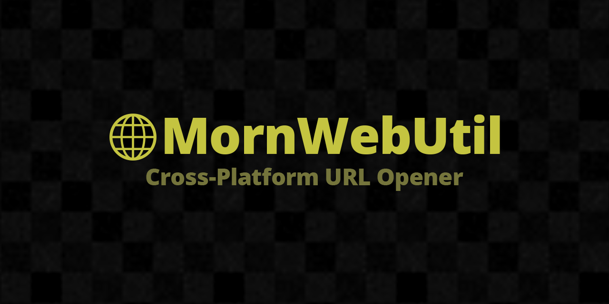

# MornWebUtil

<p align="center">
  
</p>

<p align="center">
  
</p>

## 概要

WebGL・エディタ上で URL をブラウザで開くためのユーティリティライブラリです。

## 導入方法

Unity Package Manager で以下の Git URL を追加:

```
https://github.com/TsukumiStudio/MornWebUtil.git
```

`Window > Package Manager > + > Add package from git URL...` に貼り付けてください。

## 使い方

```csharp
using MornLib;

MornWebUtil.Open("https://example.com");
```

UI ボタンから開く場合は `MornWebOpenURLButton` コンポーネントをアタッチし、URL を設定してください。

### プラットフォーム別動作

| プラットフォーム | 動作 |
|---|---|
| WebGL | JavaScript の `window.open()` を呼び出し |
| エディタ | `System.Diagnostics.Process.Start()` で開く |
| その他 | ログ出力のみ |

## ライセンス

[The Unlicense](LICENSE)
